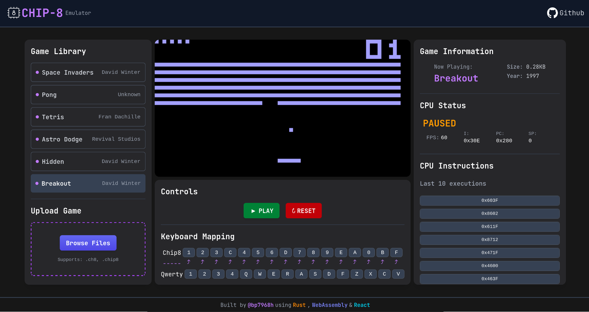

# chip8-emu

A CHIP-8 emulator written in Rust, intended to run in the browser using WebAssembly and React.



## Overview

This project implements a CHIP-8 virtual machine. CHIP-8 is an interpreted programming language, originally used on some DIY microcomputers in the late 1970s. Emulators allow us to run these retro programs on modern hardware.

This emulator currently supports the core CHIP-8 instruction set wihch the core is written in Rust, compiled to WebAssembly for fast instruction exececution and presented through responsive and intuitive React frontend. The architecture is designed to be modular, making it easier to integrate with front-end technologies like React for rendering the display and handling input. 

## Features

- **Cross-Platform Core**: The heart of the emulator is a highly optimized Rust core, capable of running both natively (via SDL2) and in the browser (via WebAssembly).
- **WebAssembly Powered**: Experience near-native performance directly in your browser, thanks to Rust's efficient WebAssembly compilation.
- **Rich React Frontend**:
  - **Intuitive Controls**: Play, Pause, and Reset functionality.
  - **Game Library**: Easily load and play a curated selection of classic CHIP-8 ROMs.
  - **Custom ROM Upload**: Bring your own .ch8 ROMs to life with a simple file upload.
  - **Real-time CPU Status**: Monitor the emulator's state with live updates on `FPS`, `Program Counter (PC)`, `Stack Pointer (SP)`, and the `last 10 executed opcodes`.
  - **Clear Keyboard Mapping**: A dedicated section visually explains how your QWERTY keyboard maps to the CHIP-8's hexadecimal keypad.
  - **Game Information**: Displays details about the currently loaded game (size, year).
- **Accurate Emulation**: Supports the core CHIP-8 instruction set, including 64x32 monochrome graphics, 16 general-purpose registers, index register, stack, and delay/sound timers.
- **Responsive Design**: Enjoy the emulator on various screen sizes.

## Technologies Used

- **Backend/Core**:
    - **Rust**: For the high-performance, low-level emulation logic.
    - **wasm_bindgen**: Bridging Rust and JavaScript for seamless WebAssembly integration.
    - **sdl2 (Native build)**: For desktop rendering when building the native Rust executable.
- **Frontend**:
    - **React**: For building the dynamic and interactive user interface.
    - **Tailwind CSS**: For rapid and consistent styling.

## Getting Started

To get a local copy up and running, follow these simple steps.

### Prerequisites
- Rust & Cargo
- Node.js & npm/yarn
- wasm-pack: For building Rust to WebAssembly
  ```bash
    cargo install wasm-pack
  ```
- sdl2: Optional for native desktop application
- Docker: For containerized setup

### Installation & Running Locally

1. Clone the repository
    ```bash
     git clone https://github.com/bp7968h/chip8-emu.git
     cd chip8-emu
    ```
2. Build and Run development server
    ```bash
      npm run wasm:build && npm install && npm run dev
    ```
This will usually open `http://localhost:5173` in your browser, where you can interact with the emulator.

### Running with Docker (Quick Setup)

If you have Docker installed, you can get the entire application (Rust/WASM build + React frontend) up and running with a single command.

1. Clone the repository
    ```bash
     git clone https://github.com/bp7968h/chip8-emu.git
     cd chip8-emu
    ```
2. Build and run the Docker container:
    ```bash
    docker build -t chip8-emu-web .
    docker run -p 8080:80 chip8-emu-web
    ```
3. Access the application:
   Open your browser and navigate to `http://localhost:8080`.

## Contributing

Contributions are welcome! Feel free to submit issues or pull requests to improve the editor.

## License

This project is licensed under the [MIT License](LICENSE).